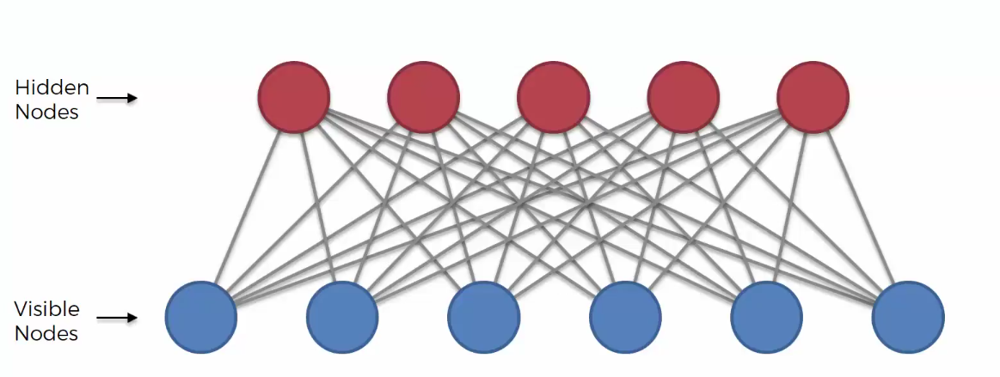
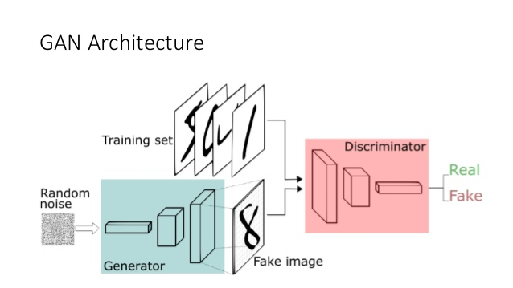

# Restricted Boltzmann Machines

## Implementation Details
* The implemented RBM consist of 2 layers with 784 visible units and 256 hidden units.
* Trained using K-Contrastive Divergence with k = 1.
* The RBM can be modified as per the use.
* It is built solely from scratch using NumPy.
* It is trained for MNIST Reconstruction and learning its probability distribution.
* Trained on 60000 images.
* It is modular in nature so you could change the parameters as per your choice.

## How to Use
* Download the train_images from [here](https://raw.githubusercontent.com/sebastianlapuschkin/lrp_toolbox/master/data/MNIST/train_images.npy)
* For sample demonstration a clipped image is reconstructed using trained RBM.
* The notebook is ready to run.

# Generative Adversarial Networks

# Variational Autoencoders

## For learning
* To learn the concepts please watch the [videos](https://www.youtube.com/watch?v=lXrFX3vjtjQ&list=PL3pGy4HtqwD2kwldm81pszxZDJANK3uGV&index=135)
* The notations are also similar.

### Have Fun! Learning :smiley:
